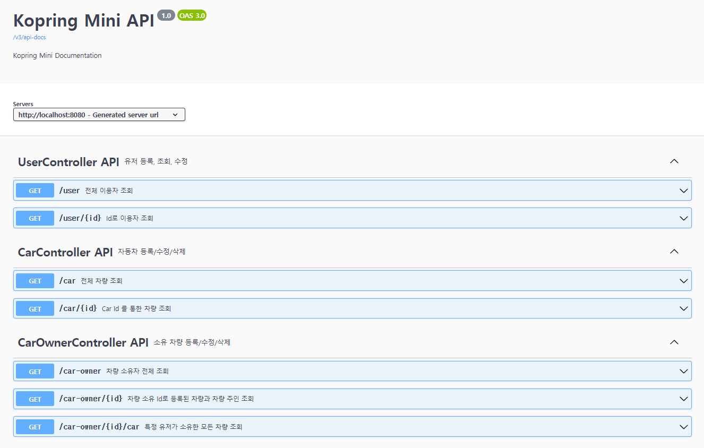

## 📒 미션 내역 

###  ✏️ 테이블 설계️

> [!NOTE]
> * [미션 2] 테이블 설계하기

 

### ✏️ `REST API` 설계 

> [!NOTE]
> * [미션 3] `REST API` 설계 

---

### ✏️ `조회 REST API` 만들기

#### `+추가`
> 일단 `InmemoryUserDetailManager` 를 이용하여 간단하게 `spring security` 적용 ...
> 다음 미션엔 완성(예정..?)