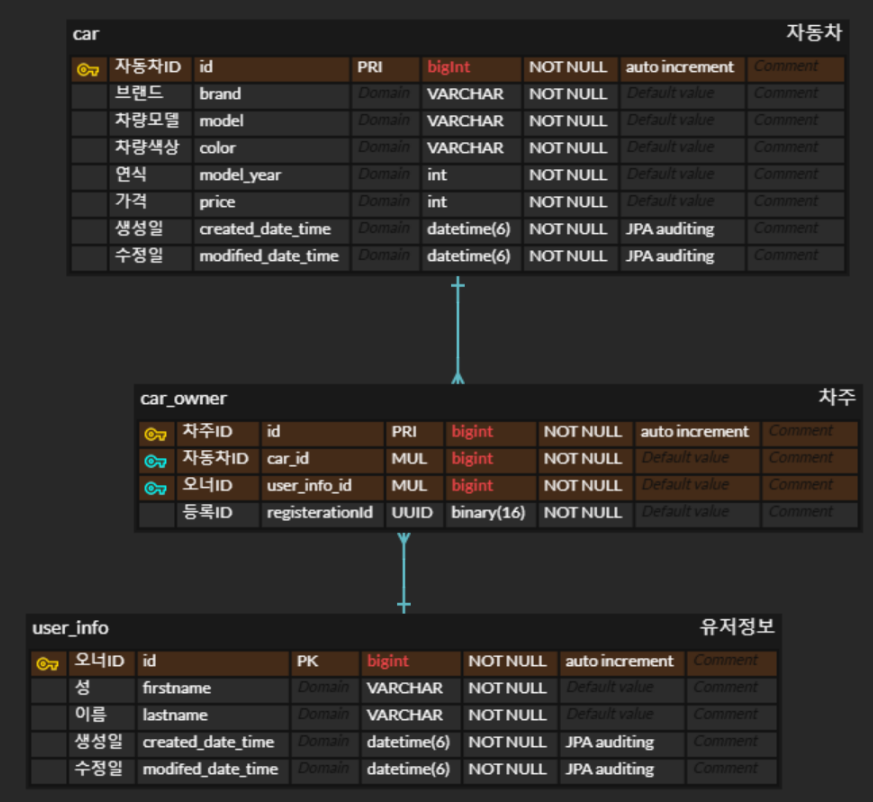

## 📒 미션 내역 

###  ✏️ 테이블 설계️

> [!NOTE]
> * [미션 2] 테이블 설계하기

 

### ✏️ `REST API` 설계 

> [!NOTE]
> * [미션 3] `REST API` 설계 

---

### ✏️ `조회 REST API` 만들기

> `swagger(경로 = /swagger-ui)` 적용 

#### `+추가`
> 일단 `InmemoryUserDetailManager` 를 이용하여 간단하게 `spring security` 적용 (id = 'user', password = 'password')...
